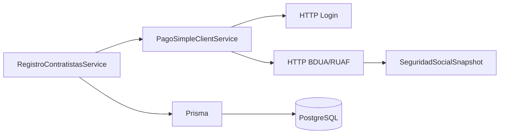

# Plan de migración: Java + Oracle -> NestJS + Prisma + PostgreSQL

## Objetivo

Este documento define el paso a paso para migrar el backend heredado en Java/Oracle al backend nuevo en NestJS + Prisma + PostgreSQL, usando el proyecto actual de `cuentas-cobro-api` como base de referencia funcional, pero no como modelo final de producción.

La prioridad es migrar **endpoint por endpoint**, con validación en cada corte, para evitar regresiones y conservar la lógica de negocio ya probada.

## Principios de la migración

1. Migrar en **cortes pequeños y verificables**.
2. Mantener **paridad funcional** con el backend Java hasta terminar la migración.
3. No mezclar migración funcional con rediseño profundo del dominio.
4. Separar claramente:
   - dominio
   - persistencia
   - integración externa
   - validaciones
   - pruebas
5. Tratar `PagoSimple` como una **frontera externa** con su propio cliente, timeouts, reintentos y manejo de error.
6. Evitar cambios destructivos sobre tablas existentes hasta tener respaldo y validación.
7. Cada endpoint migrado debe quedar:
   - implementado
   - documentado en Swagger
   - probado
   - validado con datos reales o fixtures

## Base de referencia

### Proyecto Java heredado

Se usa como referencia funcional el proyecto Java que integra:

- onboarding de contratistas
- consulta de seguridad social en PagoSimple
- contratos
- presupuesto
- cuentas de cobro
- aprobaciones por supervisor y aprobador

### Proyecto destino

El proyecto NestJS + Prisma ya tiene:

- PostgreSQL como base de datos
- `PrismaService`
- módulos por dominio
- autenticación JWT
- flujos de contratos, cuentas de cobro, presupuesto, revisión y registro de contratistas

## Criterio de migración correcto

La migración correcta no es “copiar clase por clase”, sino hacer esto:

1. Identificar el endpoint actual en Java.
2. Definir su equivalente exacto en NestJS.
3. Migrar DTO, lógica, persistencia e integración asociada.
4. Validar el contrato de respuesta.
5. Cubrirlo con pruebas.
6. Solo entonces pasar al siguiente endpoint.

## Orden recomendado de migración

### Fase 0. Preparación

1. Congelar el comportamiento actual del backend Java.
2. Levantar un inventario de endpoints, DTOs, estados y tablas.
3. Definir el modelo de datos objetivo en Prisma.
4. Separar credenciales y secretos en variables de entorno.
5. Definir ambientes de trabajo:
   - desarrollo
   - QA / staging
   - producción

### Fase 1. Base técnica

1. Validar el esquema Prisma.
2. Ejecutar migraciones iniciales.
3. Confirmar conexión a PostgreSQL.
4. Configurar:
   - `PrismaClient`
   - módulos NestJS
   - Swagger
   - validación global
   - manejo global de errores
5. Asegurar que el proyecto compila y corre limpio antes de migrar endpoints.

### Fase 2. Autenticación y usuarios

Migrar primero lo que menos depende de otros flujos.

#### Endpoints

- `POST /auth/login`
- `POST /auth/me`
- `POST /auth/cambiar-password`
- `POST /auth/usuarios`
- `GET /auth/usuarios/contratistas`
- `POST /auth/dev-token`

#### Qué validar

- JWT funcional.
- Roles correctos.
- Contraseñas temporales.
- Cambio obligatorio de contraseña.
- Usuarios contratistas creados desde el flujo de registro.

#### Buenas prácticas

- No mezclar lógica de auth con lógica de negocio.
- Probar tokens inválidos, expirados y sin rol.
- Mantener hashes compatibles con bcrypt.

### Fase 3. Contratos

Migrar este módulo antes de cualquier flujo que dependa de contratos.

#### Endpoints

- `GET /contratos`
- `GET /contratos/admin`
- `GET /contratos/contratistas`
- `GET /contratos/tipos-plazo`
- `GET /contratos/supervisor`
- `POST /contratos`
- `PATCH /contratos/:codigoContrato`
- `DELETE /contratos/:codigoContrato`
- `POST /contratos/:codigoContrato/clonar`

#### Qué validar

- CRUD completo.
- Filtros por rol.
- Clonado correcto.
- Numeración de contrato.
- Compatibilidad con los nuevos campos:
  - `numero_contrato`
  - `fecha_suscripcion`
  - `objeto`
  - `tercero_id`
  - `compromiso_id`
  - `dependencia_id`
  - `ccostos_id`
  - `numero_acta_inicio` como texto

#### Buenas prácticas

- Agregar columnas primero como opcionales.
- No convertir IDs de negocio en FKs sin confirmación funcional.
- Mantener `codigoContrato` como llave de negocio si el sistema ya depende de él.

### Fase 4. Presupuesto y precarga

Este módulo es clave porque alimenta el registro de contratistas.

#### Endpoints

- `POST /presupuesto/precarga`
- `GET /presupuesto/tercero`

#### Qué validar

- Resolución de tercero por identificación.
- Precarga de terceros.
- Consistencia con contratos.

#### Buenas prácticas

- Mantener compatibilidad con el flujo que resuelve `codigoTercero`.
- Registrar errores de sincronización con catálogo o tercero.

### Fase 5. Registro de contratistas

Este es el módulo que más se conecta con `PagoSimple`.

#### Endpoints actuales en NestJS

- `POST /registro-contratistas/extraer`
- `POST /registro-contratistas/finalizar`

#### Endpoints equivalentes que deben quedar cubiertos funcionalmente

- extracción de RUT
- extracción de certificado bancario
- finalización del registro
- consulta de seguridad social

#### Qué validar

- Extracción de datos desde PDF.
- Creación de usuario contratista.
- Detección de duplicados.
- Resolución de tercero por presupuesto.
- Generación de username y contraseña temporal.

## Fase 6. Migración de PagoSimple

Esta fase debe hacerse con especial cuidado.

### Objetivo de PagoSimple

Reproducir la integración de seguridad social sin romper el flujo principal de registro.

### Principio clave

`PagoSimple` debe ser un **servicio aislado** y no una lógica dispersa dentro del flujo de registro.

### Endpoint funcional a migrar primero

- `GET /registro-contratistas/seguridad-social`

Si el proyecto final decide mantener otra ruta, la regla sigue siendo la misma: primero la consulta aislada, luego la integración en el flujo de finalización.

### Orden de migración de PagoSimple

1. Crear `PagoSimpleModule`.
2. Crear `PagoSimpleClientService`.
3. Crear DTOs de request y response.
4. Mover credenciales a variables de entorno.
5. Implementar login.
6. Implementar consulta BDUA/RUAF.
7. Agregar timeout y reintentos.
8. Agregar cache de token si el proveedor lo permite.
9. Exponer la consulta como endpoint propio.
10. Integrar la consulta en el flujo de registro.

### Reglas de negocio que deben conservarse

- Si el frontend ya envió EPS o AFP, respetar el valor manual.
- Si falta EPS o AFP, consultar PagoSimple y completar solo lo faltante.
- Si PagoSimple falla, el registro no debe romperse.
- Las fechas y el régimen deben venir de PagoSimple cuando existan.
- No asumir que la respuesta siempre trae un solo registro sin validar.

### Buenas prácticas para PagoSimple

- Nunca hardcodear credenciales.
- Usar `ConfigService` o un wrapper de configuración.
- Separar DTOs externos del modelo de dominio.
- Guardar trazabilidad del origen de los datos.
- Loguear sin exponer secretos.
- Manejar:
  - respuesta vacía
  - token inválido
  - timeout
  - respuesta malformada
  - documento no encontrado

### Patrón recomendado

### Criterio de aceptación por endpoint de PagoSimple

Un endpoint de PagoSimple queda terminado solo cuando:

- responde igual que el flujo anterior o mejor
- no rompe si el proveedor cae
- tiene pruebas unitarias
- tiene pruebas de integración
- está documentado en Swagger
- usa configuración por ambiente

### Secuencia sugerida de trabajo

1. Crear pruebas con respuestas simuladas.
2. Implementar el cliente.
3. Exponer consulta aislada.
4. Conectar el flujo de finalización.
5. Validar con documentos reales.
6. Registrar la salida en base de datos si aplica.

### Nota de diseño

PagoSimple no debe quedarse mezclado con `registro-contratistas.service.ts`. El servicio de registro debe orquestar; el cliente de PagoSimple debe resolver la integración.

### Fase 7. Cuentas de cobro

Una vez estabilizado `Contrato`, `Auth`, `Presupuesto` y `PagoSimple`, se migra el flujo transaccional principal.

#### Endpoints

- `POST /cuentas-cobro`
- `GET /cuentas-cobro`
- `GET /cuentas-cobro/:id/resumen-radicacion`
- `POST /cuentas-cobro/:id/radicar`
- `GET /cuentas-cobro/:id`

#### Qué validar

- creación de borrador
- consulta de listados
- resumen antes de radicar
- cambio de estado a radicada
- consulta por detalle

#### Buenas prácticas

- Toda transición de estado debe ser explícita.
- Registrar historial de cambios.
- Evitar mutaciones silenciosas.

### Fase 8. Planilla

#### Endpoints

- `GET /planilla/:cuentaCobroId`
- `POST /planilla/:cuentaCobroId/pagosimple/test`
- `POST /planilla/:cuentaCobroId/pagosimple/mock-confirmacion`

#### Qué validar

- datos de planilla
- simulación o integración real con PagoSimple
- confirmaciones idempotentes

#### Buenas prácticas

- Si `PagoSimple` deja de ser mock, aislar la lógica en un cliente único.
- Mantener pruebas para el flujo feliz y el fallo.

### Fase 9. Checklist, actividades, gastos y ejecución física

#### Endpoints

- `GET /checklist-retefuente/:cuentaCobroId`
- `PATCH /checklist-retefuente/:cuentaCobroId`
- `POST /supervisor/cuentas-cobro/:id/secciones/ejecucion-fisica/digitar`
- `POST /supervisor/cuentas-cobro/:id/secciones/ejecucion-fisica/aprobar`
- `POST /supervisor/cuentas-cobro/:id/secciones/ejecucion-fisica/rechazar`

#### Qué validar

- persistencia por sección
- observaciones
- estados de aprobación
- consistencia de datos por cuenta de cobro

### Fase 10. Revisión supervisor y aprobador

#### Supervisor

- `GET /supervisor/cuentas-cobro`
- `POST /supervisor/cuentas-cobro/:id/aprobar`
- `POST /supervisor/cuentas-cobro/:id/rechazar`
- secciones:
  - informe de गतिविधades
  - planilla
  - retenciones
  - gastos adicionales
  - ejecución física

#### Aprobador

- `GET /aprobador/cuentas-cobro`
- `POST /aprobador/cuentas-cobro/:id/aprobar`
- `POST /aprobador/cuentas-cobro/:id/rechazar`
- mismas secciones que supervisor

#### Qué validar

- machine de estados completa
- rechazo con observación
- no permitir aprobaciones inválidas
- trazabilidad del usuario que aprobó o rechazó

## Checklist operativo por cada endpoint

Antes de marcar un endpoint como migrado, verificar:

1. Ruta creada en NestJS.
2. DTO de entrada validado.
3. Servicio con lógica de dominio.
4. Persistencia en Prisma.
5. Manejo de errores.
6. Swagger actualizado.
7. Prueba unitaria.
8. Prueba de integración o e2e.
9. Respuesta equivalente a la versión Java.
10. Revisión manual en Postman o Insomnia.

## Reglas de oro para evitar errores

1. No migrar dos cambios grandes al mismo tiempo.
2. No tocar contrato y planilla a la vez si uno depende del otro.
3. No meter integración externa dentro del controller.
4. No usar `any` para los DTOs.
5. No dejar secretos en el repo.
6. No convertir una columna a obligatoria sin backfill.
7. No borrar el flujo Java hasta tener validado el flujo Nest.
8. No confiar en que PagoSimple siempre responde.

## Estrategia de corte y salida a producción

1. Terminar la paridad endpoint por endpoint.
2. Correr pruebas de regresión con datos reales.
3. Comparar respuestas Java vs Nest.
4. Validar migraciones de base de datos.
5. Congelar el backend Java.
6. Cambiar el consumidor a Nest.
7. Monitorear durante estabilización.

## Resultado esperado

Al final de este plan deberíamos tener:

- backend NestJS + Prisma funcionando sobre PostgreSQL
- módulos migrados uno por uno
- `PagoSimple` desacoplado y estable
- contratos con los campos nuevos ya incorporados
- trazabilidad de estados y validaciones
- menor riesgo de errores por migraciones grandes

## Próximo paso sugerido

Después de aprobar este plan, el siguiente paso lógico es construir el **módulo PagoSimple** en NestJS con esta secuencia:

1. configuración
2. cliente HTTP
3. DTOs
4. pruebas
5. endpoint aislado de consulta
6. integración al flujo de registro

