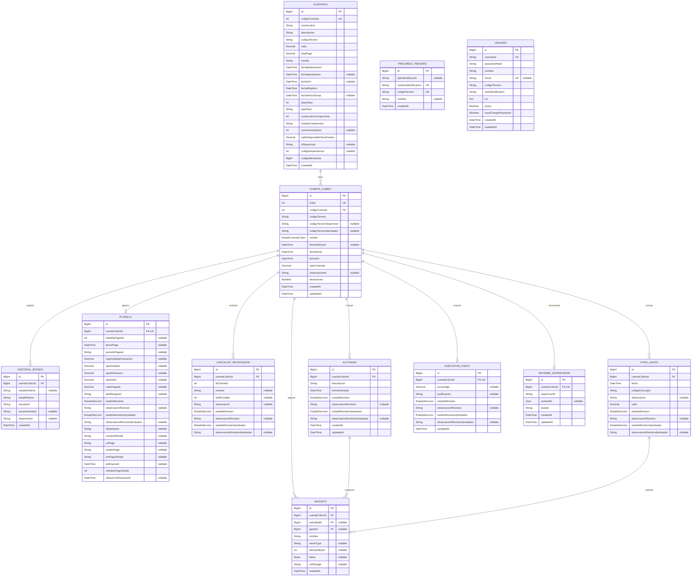

# ERD

Diagrama entidad-relacion basado en `prisma/schema.prisma`.

## Enums

| Enum | Valores |
|---|---|
| `Rol` | `CONTRATISTA`, `SUPERVISOR`, `APROBADOR`, `ADMINISTRADOR`, `ABOGADO` |
| `EstadoCuentaCobro` | `BORRADOR`, `RADICADA`, `EN_REVISION_SUPERVISOR`, `DEVUELTA_CONTRATISTA`, `APROBADA_SUPERVISOR`, `EN_REVISION_APROBADOR`, `RECHAZADA_APROBADOR`, `LIQUIDADA`, `ENVIADA_CONTABILIDAD` |
| `EstadoSeccion` | `PENDIENTE`, `APROBADO`, `RECHAZADO`, `SIN_OBSERVACIONES` |

## Notas

- `CONTRATO.codigoContrato` es la clave referenciada por `CUENTA_COBRO.codigoContrato`.
- `PLANILLA`, `EJECUCION_FISICA` e `INFORME_SUPERVISION` son relaciones 1:1 con `CUENTA_COBRO`.
- `ADJUNTO` siempre pertenece a una `CUENTA_COBRO` y opcionalmente a una `ACTIVIDAD` o a un `OTRO_GASTO`.
- `USUARIO` y `CONTRATO`/`CUENTA_COBRO` se relacionan de forma logica por `codigoTercero`, pero no hay FK fisica en el esquema.
