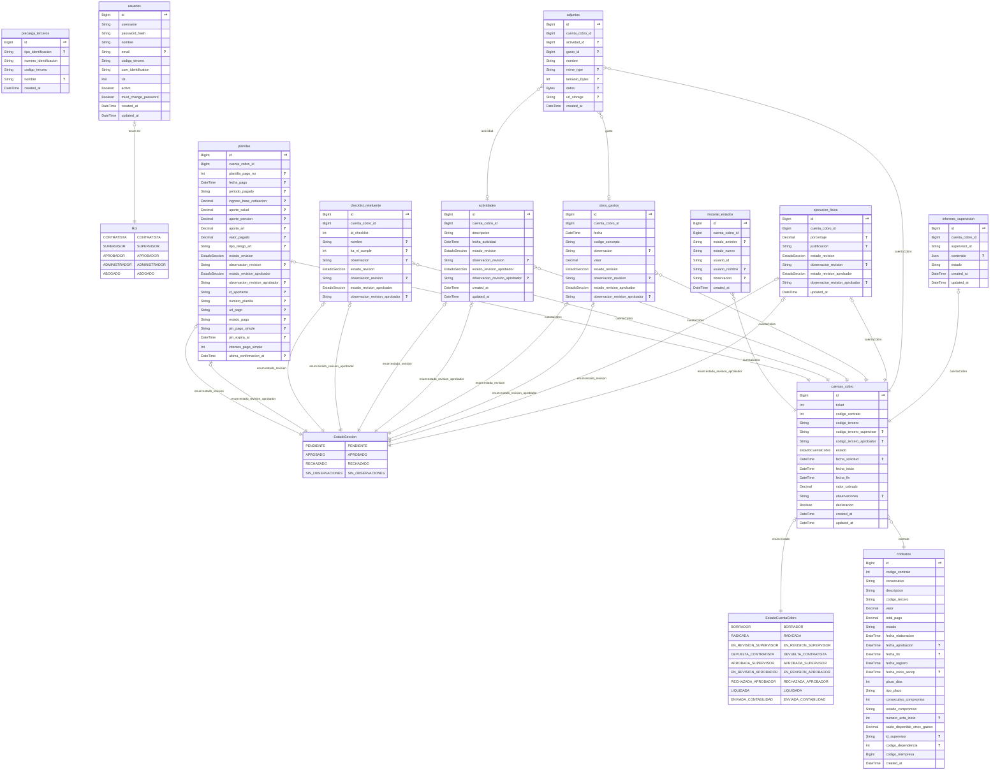

```mermaid
erDiagram

        Rol {
            CONTRATISTA CONTRATISTA
SUPERVISOR SUPERVISOR
APROBADOR APROBADOR
ADMINISTRADOR ADMINISTRADOR
ABOGADO ABOGADO
        }
    


        EstadoCuentaCobro {
            BORRADOR BORRADOR
RADICADA RADICADA
EN_REVISION_SUPERVISOR EN_REVISION_SUPERVISOR
DEVUELTA_CONTRATISTA DEVUELTA_CONTRATISTA
APROBADA_SUPERVISOR APROBADA_SUPERVISOR
EN_REVISION_APROBADOR EN_REVISION_APROBADOR
RECHAZADA_APROBADOR RECHAZADA_APROBADOR
LIQUIDADA LIQUIDADA
ENVIADA_CONTABILIDAD ENVIADA_CONTABILIDAD
        }
    


        EstadoSeccion {
            PENDIENTE PENDIENTE
APROBADO APROBADO
RECHAZADO RECHAZADO
SIN_OBSERVACIONES SIN_OBSERVACIONES
        }
    
  "contratos" {
    BigInt id "🗝️"
    Int codigo_contrato 
    String consecutivo 
    String descripcion 
    String codigo_tercero 
    Decimal valor 
    Decimal total_pago 
    String estado 
    DateTime fecha_elaboracion 
    DateTime fecha_aprobacion "❓"
    DateTime fecha_fin "❓"
    DateTime fecha_registro 
    DateTime fecha_inicio_secop "❓"
    Int plazo_dias 
    String tipo_plazo 
    Int consecutivo_compromiso 
    String estado_compromiso 
    Int numero_acta_inicio "❓"
    Decimal saldo_disponible_otros_gastos 
    String id_supervisor "❓"
    Int codigo_dependencia "❓"
    BigInt codigo_mempresa 
    DateTime created_at 
    }
  

  "precarga_terceros" {
    BigInt id "🗝️"
    String tipo_identificacion "❓"
    String numero_identificacion 
    String codigo_tercero 
    String nombre "❓"
    DateTime created_at 
    }
  

  "usuarios" {
    BigInt id "🗝️"
    String username 
    String password_hash 
    String nombre 
    String email "❓"
    String codigo_tercero 
    String user_identification 
    Rol rol 
    Boolean activo 
    Boolean must_change_password 
    DateTime created_at 
    DateTime updated_at 
    }
  

  "cuentas_cobro" {
    BigInt id "🗝️"
    Int ticket 
    Int codigo_contrato 
    String codigo_tercero 
    String codigo_tercero_supervisor "❓"
    String codigo_tercero_aprobador "❓"
    EstadoCuentaCobro estado 
    DateTime fecha_solicitud "❓"
    DateTime fecha_inicio 
    DateTime fecha_fin 
    Decimal valor_cobrado 
    String observaciones "❓"
    Boolean declaracion 
    DateTime created_at 
    DateTime updated_at 
    }
  

  "historial_estados" {
    BigInt id "🗝️"
    BigInt cuenta_cobro_id 
    String estado_anterior "❓"
    String estado_nuevo 
    String usuario_id 
    String usuario_nombre "❓"
    String observacion "❓"
    DateTime created_at 
    }
  

  "planillas" {
    BigInt id "🗝️"
    BigInt cuenta_cobro_id 
    Int plantilla_pago_no "❓"
    DateTime fecha_pago "❓"
    String periodo_pagado "❓"
    Decimal ingreso_base_cotizacion "❓"
    Decimal aporte_salud "❓"
    Decimal aporte_pension "❓"
    Decimal aporte_arl "❓"
    Decimal valor_pagado "❓"
    String tipo_riesgo_arl "❓"
    EstadoSeccion estado_revision 
    String observacion_revision "❓"
    EstadoSeccion estado_revision_aprobador 
    String observacion_revision_aprobador "❓"
    String id_aportante "❓"
    String numero_planilla "❓"
    String url_pago "❓"
    String estado_pago "❓"
    String pin_pago_simple "❓"
    DateTime pin_expira_at "❓"
    Int intentos_pago_simple 
    DateTime ultima_confirmacion_at "❓"
    }
  

  "checklist_retefuente" {
    BigInt id "🗝️"
    BigInt cuenta_cobro_id 
    Int id_checklist 
    String nombre "❓"
    Int ka_nl_cumple "❓"
    String observacion "❓"
    EstadoSeccion estado_revision 
    String observacion_revision "❓"
    EstadoSeccion estado_revision_aprobador 
    String observacion_revision_aprobador "❓"
    }
  

  "actividades" {
    BigInt id "🗝️"
    BigInt cuenta_cobro_id 
    String descripcion 
    DateTime fecha_actividad 
    EstadoSeccion estado_revision 
    String observacion_revision "❓"
    EstadoSeccion estado_revision_aprobador 
    String observacion_revision_aprobador "❓"
    DateTime created_at 
    DateTime updated_at 
    }
  

  "otros_gastos" {
    BigInt id "🗝️"
    BigInt cuenta_cobro_id 
    DateTime fecha 
    String codigo_concepto 
    String observacion "❓"
    Decimal valor 
    EstadoSeccion estado_revision 
    String observacion_revision "❓"
    EstadoSeccion estado_revision_aprobador 
    String observacion_revision_aprobador "❓"
    }
  

  "ejecucion_fisica" {
    BigInt id "🗝️"
    BigInt cuenta_cobro_id 
    Decimal porcentaje "❓"
    String justificacion "❓"
    EstadoSeccion estado_revision 
    String observacion_revision "❓"
    EstadoSeccion estado_revision_aprobador 
    String observacion_revision_aprobador "❓"
    DateTime updated_at 
    }
  

  "adjuntos" {
    BigInt id "🗝️"
    BigInt cuenta_cobro_id 
    BigInt actividad_id "❓"
    BigInt gasto_id "❓"
    String nombre 
    String mime_type "❓"
    Int tamanio_bytes "❓"
    Bytes datos "❓"
    String url_storage "❓"
    DateTime created_at 
    }
  

  "informes_supervision" {
    BigInt id "🗝️"
    BigInt cuenta_cobro_id 
    String supervisor_id 
    Json contenido "❓"
    String estado 
    DateTime created_at 
    DateTime updated_at 
    }
  
    "usuarios" |o--|| "Rol" : "enum:rol"
    "cuentas_cobro" |o--|| "EstadoCuentaCobro" : "enum:estado"
    "cuentas_cobro" }o--|| contratos : "contrato"
    "historial_estados" }o--|| cuentas_cobro : "cuentaCobro"
    "planillas" |o--|| "EstadoSeccion" : "enum:estado_revision"
    "planillas" |o--|| "EstadoSeccion" : "enum:estado_revision_aprobador"
    "planillas" |o--|| cuentas_cobro : "cuentaCobro"
    "checklist_retefuente" |o--|| "EstadoSeccion" : "enum:estado_revision"
    "checklist_retefuente" |o--|| "EstadoSeccion" : "enum:estado_revision_aprobador"
    "checklist_retefuente" }o--|| cuentas_cobro : "cuentaCobro"
    "actividades" |o--|| "EstadoSeccion" : "enum:estado_revision"
    "actividades" |o--|| "EstadoSeccion" : "enum:estado_revision_aprobador"
    "actividades" }o--|| cuentas_cobro : "cuentaCobro"
    "otros_gastos" |o--|| "EstadoSeccion" : "enum:estado_revision"
    "otros_gastos" |o--|| "EstadoSeccion" : "enum:estado_revision_aprobador"
    "otros_gastos" }o--|| cuentas_cobro : "cuentaCobro"
    "ejecucion_fisica" |o--|| "EstadoSeccion" : "enum:estado_revision"
    "ejecucion_fisica" |o--|| "EstadoSeccion" : "enum:estado_revision_aprobador"
    "ejecucion_fisica" |o--|| cuentas_cobro : "cuentaCobro"
    "adjuntos" }o--|| cuentas_cobro : "cuentaCobro"
    "adjuntos" }o--|o actividades : "actividad"
    "adjuntos" }o--|o otros_gastos : "gasto"
    "informes_supervision" |o--|| cuentas_cobro : "cuentaCobro"
```
