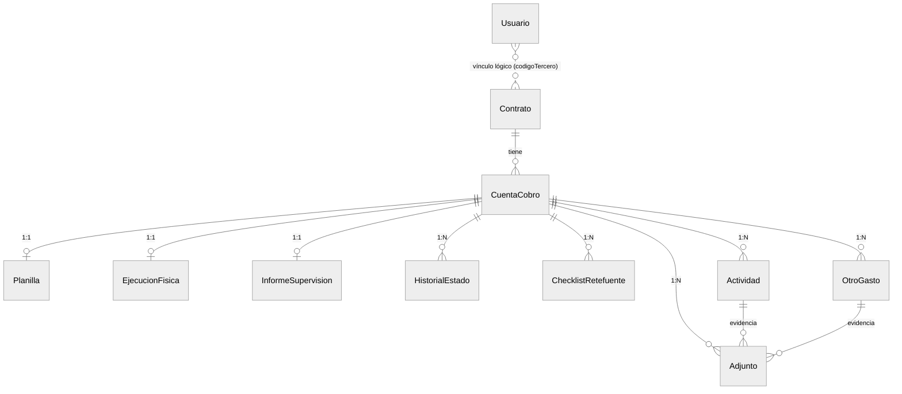
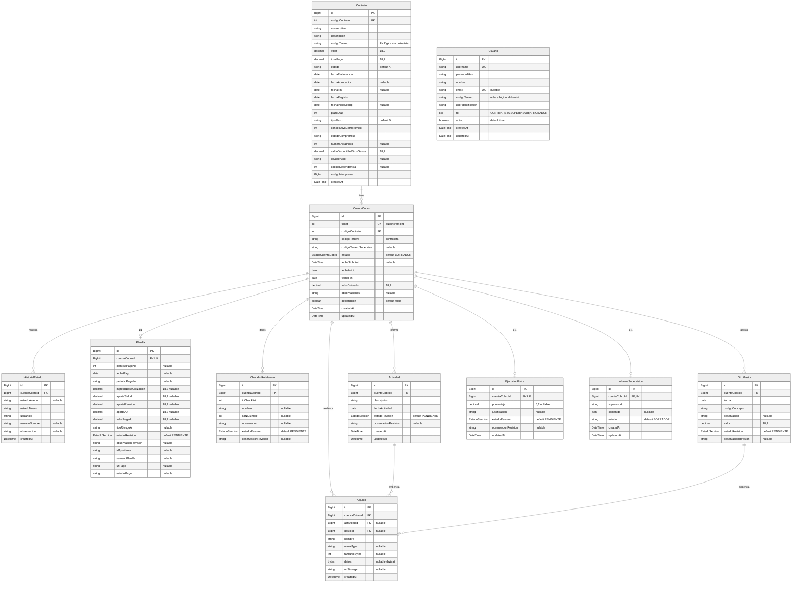

# Modelo de Datos — Cuentas de Cobro API

> Diagrama entidad-relación basado en `prisma/schema.prisma`. Pégalo en GitHub, Notion, [mermaid.live](https://mermaid.live) o ábrelo con la vista previa de VS Code (`Ctrl+Shift+V`).
>
> 💡 **Para verlo grande:** en mermaid.live puedes hacer zoom y exportar PNG/SVG. En la preview de VS Code usa `Ctrl` + rueda del ratón para acercar.

---

## 1. Mapa general (vista rápida)

Cómo se conectan las entidades, sin atributos. `CuentaCobro` es el centro del modelo.

**Cómo leer las líneas:**

| Símbolo | Significado |
|---|---|
| `||--o|` | Uno a **uno** (0 o 1) |
| `||--o{` | Uno a **muchos** (0, 1 o varios) |
| `}o..o{` | Relación **lógica** (sin FK física en la BD) |

---

## 2. Diagrama detallado (con campos)

---

## 3. Enums

| Enum | Valores |
|---|---|
| **Rol** | `CONTRATISTA`, `SUPERVISOR`, `APROBADOR`, `ADMINISTRADOR` |
| **EstadoCuentaCobro** | `BORRADOR`, `RADICADA`, `EN_REVISION_SUPERVISOR`, `DEVUELTA_CONTRATISTA`, `APROBADA_SUPERVISOR`, `EN_REVISION_APROBADOR`, `RECHAZADA_APROBADOR`, `LIQUIDADA`, `ENVIADA_CONTABILIDAD` |
| **EstadoSeccion** | `PENDIENTE`, `APROBADO`, `RECHAZADO` |

> Los valores exactos viven en `prisma/schema.prisma`.

---

## 4. Notas clave

- **Usuario** no tiene FK física hacia `Contrato`/`CuentaCobro`: el vínculo es **lógico** vía `codigoTercero`.
- **`Contrato.codigoContrato`** (no el `id`) es la clave referenciada por `CuentaCobro.codigoContrato`.
- Relaciones **1:1** (`||--o|`): `Planilla`, `EjecucionFisica`, `InformeSupervision` (FK `cuentaCobroId` con `@unique`).
- Relaciones **1:N** (`||--o{`): `HistorialEstado`, `ChecklistRetefuente`, `Actividad`, `OtroGasto`, `Adjunto`.
- **`Adjunto`** cuelga siempre de una `CuentaCobro` y, opcionalmente, de una `Actividad` **o** un `OtroGasto`.

---

> Versión automática (siempre sincronizada con el schema, sin formato): `docs/modelo-datos-auto.md` — se regenera con `npx prisma generate`.
